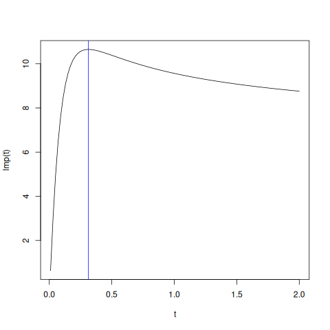

# `Kriging::logMargPostFun`

## Description

Compute the Log-Marginal Posterior Density of a `Kriging` Model Object for a given
Vector $\boldsymbol{\theta}$ of Correlation Ranges

## Usage

* Python
    ```python
    # k = Kriging(...)
    k.logMargPostFun(theta, return_grad = False)
    ```
* R
    ```r
    # k = Kriging(...)
    k$logMargPostFun(theta, return_grad = FALSE)
    ```
* Matlab/Octave
    ```octave
    % k = Kriging(...)
    k.logMargPostFun(theta, return_grad = false)
    ```


## Arguments

Argument      |Description
------------- |----------------
`theta`     |     Numeric vector of correlation range parameters at which the function is to be evaluated.
`return_grad`     |     Logical. Should the function return the gradient (w.r.t `theta`)?


## Details 

The log-marginal posterior density relates to the [*jointly robust*
prior](SecJointlyrobust) $\pi_{\texttt{JR}}(\boldsymbol{\theta},\, \sigma^2, \,
\boldsymbol{\beta}) \propto \pi(\boldsymbol{\theta}) \, \sigma^{-2}$. The
marginal (or integrated) posterior is the function
$\boldsymbol{\theta}$ obtained by marginalizing out the GP variance
$\sigma^2$ and the vector $\boldsymbol{\beta}$ of trend
coefficients. Due to the form of the prior, the marginalization can be
done on the likelihood $p_{\texttt{marg}}(\boldsymbol{\theta}\,\vert
\,\mathbf{y}) \propto \pi(\boldsymbol{\theta}) \times
L_{\texttt{marg}}(\boldsymbol{\theta};\,\mathbf{y})$.

## Value

The value of the log-marginal posterior density $\log
p_{\texttt{marg}}(\boldsymbol{\theta} \,|\, \mathbf{y})$. By
maximizing this function we should get the estimate of
$\boldsymbol{\theta}$ obtained when using `objective = "LMP"` in the
[`fit.Kriging`](fit.Kriging) method.

## Examples

```r
f <- function(x) 1 - 1 / 2 * (sin(12 * x) / (1 + x) + 2 * cos(7 * x) * x^5 + 0.7)
set.seed(123)
X <- as.matrix(runif(10))
y <- f(X)

k <- Kriging(y, X, "matern3_2", objective="LMP")
print(k)

lmp <- function(theta) k$logMargPostFun(theta)$logMargPost

t <- seq(from = 0.01, to = 2, length.out = 101)
plot(t, lmp(t), type = "l")
abline(v = k$theta(), col = "blue")
```

### Results
```{literalinclude} ../functions/examples/logMargPostFun.Kriging.md.Rout
:language: bash
```



